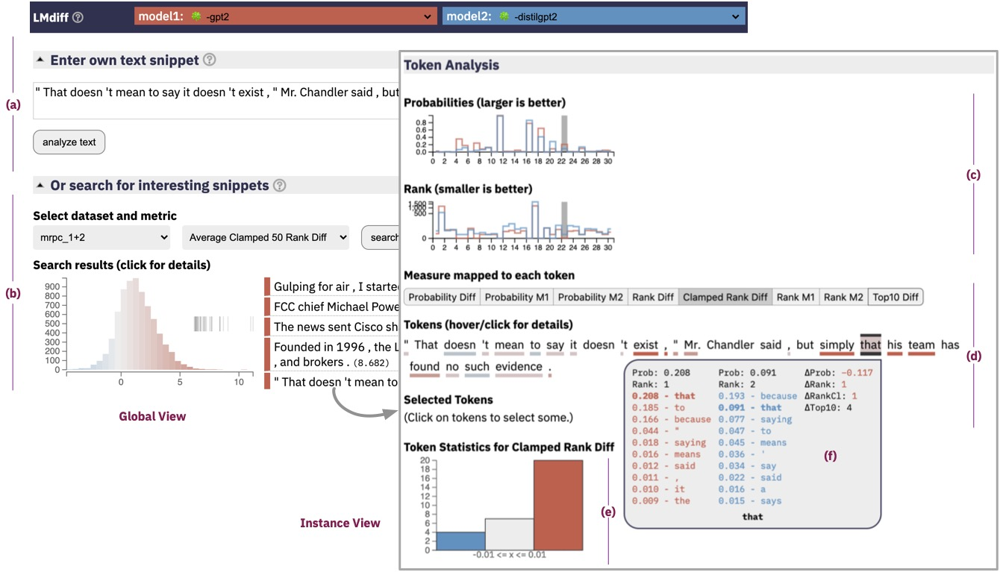

# LMdiff

Qualitative comparison of large language models.

Demo & Paper: [http://lmdiff.net](http://lmdiff.net)


<div style='text-align:center; width:100%'>

</div>


<p> LMdiff is a <a href="https://mitibmwatsonailab.mit.edu/">MIT-IBM
Watson AI Lab</a> collaboration between: <br/>
<a href="http://hendrik.strobelt.com" target="_blank">Hendrik
  Strobelt</a> (IBM, MIT) ,
<a href="https://www.bhoov.com/" target="_blank">Benjamin Hoover</a>
(IBM, GeorgiaTech),
<a href="https://arvindsatya.com/" target="_blank">Arvind
  Satyanarayan</a> (MIT),
and <a href="https://sebastiangehrmann.com/" target="_blank">Sebastian
  Gehrmann</a> (HarvardNLP, Google).</p>

## Setting up / Quick start
From the root directory install Conda dependencies:

```
conda env create -f environment.yml
conda activate LMdiff
pip install -e .
```

Install/build frontend: 

```
cd client
npm run build:backend
cd ..
```


Run the backend in development mode, deploying default models and configurations:

```
uvicorn backend.server:app --reload
```


## Using your own models

To use your own models:

1. Create a `TextDataset` of phrases to analyze

    You can create the dataset file in several ways:

    <details>
    <summary>From a text file</summary>
    So you have already collected all the phrases you want into a text file separated by newlines. Simply run:

    ```
    python scripts/make_dataset.py path/to/my_dataset.txt my_dataset -o folder/i/want/to/save/in
    ```
    </details>
    
    <details>
    <summary>From a python object (list of strings)</summary>
    Want to only work within python?

    ```python
    from analysis.create_dataset import create_text_dataset_from_object

    my_collection = ["Phrase 1", "My second phrase"]
    create_text_dataset_from_object(my_collection, "easy-first-dataset", "human_created", "folder/i/want/to/save/in")
    ```
    </details>
    
    <details>
    <summary>From [Huggingface Datasets](https://huggingface.co/docs/datasets/)</summary>
    It can be created from one of Huggingface's provided datasets with:

    ```python
    from analysis.create_dataset import create_text_dataset_from_hf_datasets
    import datasets
    import path_fixes as pf

    glue_mrpc = datasets.load_dataset("glue", "mrpc", split="train")
    name = "glue_mrpc_train"

    def ds2str(glue):
        """(e.g.,) Turn the first 50 sentences of the dataset into sentence information"""
        sentences = glue['sentence1'][:50]
        return "\n".join(sentences)

    create_text_dataset_from_hf_datasets(glue_mrpc, name, ds2str, ds_type="human_created", outfpath=pf.DATASETS)
    ```
    </details>


	The dataset is a simple `.txt` file, with a new phrase on every line, and with a bit of required metadata header at the top. E.g.,    
	
	```
	---
	checksum: 92247a369d5da32a44497be822d4a90879807a8751f5db3ff1926adbeca7ba28
	name: dataset-dummy
	type: human_created
	---
	
	This is sentence 1, please analyze this.
	Every line is a new phrase to pass to the model.
	I can keep adding phrases, so long as they are short enough to pass to the model. They don't even need to be one sentence long.
	```

	The required fields in the header:
	
	- `checksum` :: A unique identifier for the state of that file. It can be calculated however you wish, but it should change if anything at all changes in the contents below (e.g., two phrases are transposed, a new phase added, or a period is added after a sentence)
	- `name` :: The name of the dataset. 
	- `type` :: Either `human_created` or `machine_generated` if you want to compare on a dataset that was spit out by another model
	
	Each line in the contents is a new phrase to compare in the language model. A few warnings:
	
	- Make sure the phrases are short enough that they can be passed to the model given your memory constraints
	- The dataset is fully loaded into memory to serve to the front end, so avoid creating a text file that is too large to fit in memory.

2. Choose two comparable models
    
    Two models are comparable if they:

    1. Have the exact same tokenization scheme
    2. Have the exact same vocabulary

    This allows us to do tokenwise comparisons on the model. For example, this could be:
    
    - A pretrained model and a finetuned version of it (e.g., `distilbert-base-cased` and `distilbert-base-uncased-finetuned-sst-2-english`)
    - A distilled version mimicking the original model (e.g., `bert-base-cased` and `distilbert-base-cased`)
    - Different sizes of the same model architecture (e.g., `gpt2` and `gpt2-large`)


3. Preprocess the models on the chosen dataset

    ```
    python scripts/preprocess.py all gpt2-medium distilgpt2 data/datasets/glue_mrpc_1+2.csv --output-dir data/sample/gpt2-glue-comparisons
    ```

4. Start the app

    ```
    python backend/server/main.py --config data/sample/gpt2-glue-comparisons
    ```

    Note that if you use a different tokenization scheme than the default `gpt`, you will need to tell the frontend how to visualize the tokens. For example, a `bert` based tokenization scheme:

    ```
    python backend/server/main.py --config data/sample/bert-glue-comparisons -t bert
    ```

## Architecture


## (Admin) Getting the Data
Models and datasets for the deployed app are stored on the cloud and require a private `.dvc/config` file.

With the correct config:

```dvc pull```

will populate the data directories correctly for the deployed version.


<details>
<summary><b>Testing</b></summary>

```
make test
```

or

```
python -m pytest tests
```

All tests are stored in `tests`.

</details>

### Frontend

We like [`pnpm`](https://pnpm.io/installation) but `npm` works just as well. We also like [`Vite`](https://vitejs.dev/) for its rapid hot module reloading and pleasant dev experience. This repository uses [`Vue`](https://vuejs.org/) as a reactive framework.

From the root directory:

```
cd client
pnpm install --save-dev
pnpm run dev
```

If you want to hit the backend routes, make sure to also run the `uvicorn backend.server:app` command from the project root.

<details>
<summary><b>For production (serve with Vite)</b></summary>

```
pnpm run serve
```

</details>

<details>
<summary><b>For production (serve with this repo's FastAPI server)</b></summary>

```
cd client
pnpm run build:backend
cd ..
uvicorn backend.server:app
```

Or the `gunicorn` command from above.

All artifacts are stored in the `client/dist` directory with the appropriate basepath.
</details>

<details>
<summary><b>For production (serve with external tooling like NGINX)</b></summary>

```
pnpm run build
```

All artifacts are stored in the `client/dist` directory.
</details>

## Notes

- Check the endpoints by visiting `<localhost>:<port>/docs`